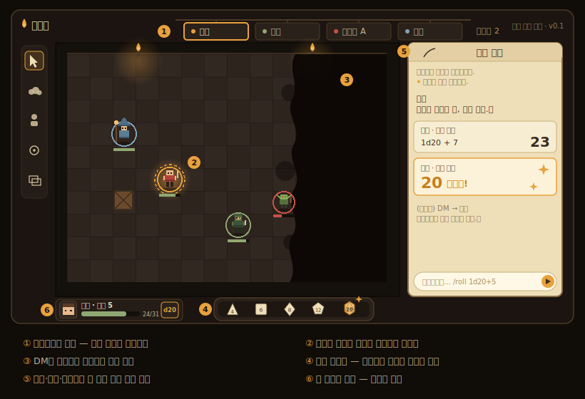
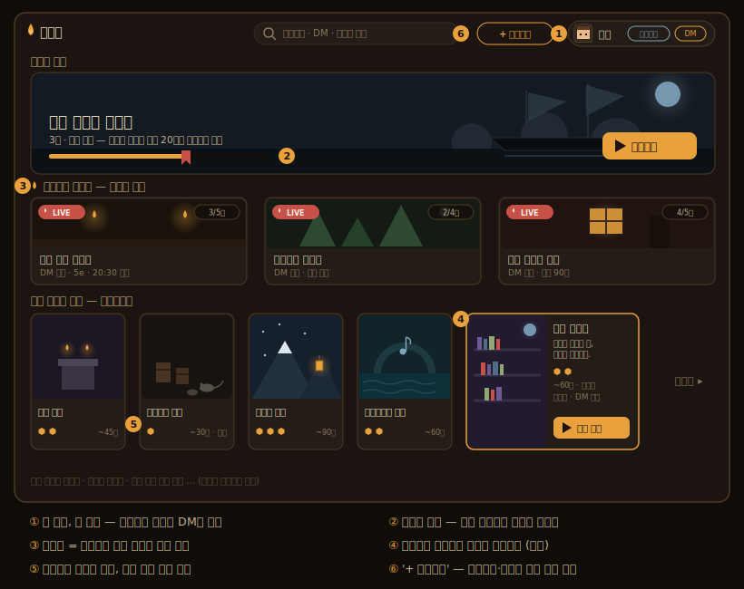

# 화롯가 (Hearthside)

> Synology DS920+ 한 대에 셀프호스팅하는 5e 호환 TRPG 플랫폼.
> **"TRPG 시나리오의 넷플릭스 + 그것을 만드는 스튜디오 + 상영관(라이브 테이블)을 한 지붕에."**

## 화롯가는 이런 곳이다

어느 밤, 친구들이 화롯불 곁에 둘러앉는다. 한 사람이 이야기를 꺼내고, 나머지는 주사위를 쥔다.
화롯가는 그 밤을 소프트웨어로 옮긴 것이다 — 다만 순서를 하나 뒤집었다.
**여기서 DM은 진행자이기 이전에 작가다.** 시나리오는 세션이 끝나면 사라지는 준비물이 아니라
서가에 꽂히는 작품이고, 플레이어는 포스터를 골라 그 이야기 속으로 들어간다.
친구들과 함께 라이브로, 혹은 혼자서 게임북처럼.

이걸 가능하게 하는 심장이 `module.json`이다. 시나리오 파일 하나를 세 개의 "플레이어"가
재생한다 — **라이브 테이블**(DM의 진행 대본), **솔로 러너**(게임북), 그리고 언젠가의
**AI DM**(같은 파일이 대본이자 가드레일이 된다). 우리는 이것을 *원소스 멀티플레이*라 부른다.

그리고 이 모든 것은 남의 서버가 아니라 **우리 집 NAS 위**에서 돈다.
우리 이야기, 우리 세이브, 우리 속도. 촛불은 우리가 켠다.

## 우리가 믿는 것

전문은 헌장([CLAUDE.md](./CLAUDE.md))에 있다. 골자만 추리면:

- **포맷이 심장이다.** 화면은 바뀌어도 `module.json`은 남는다. 에디터보다 포맷을 먼저 만들었다.
- **플레이어가 듣는 것과 DM만 아는 것은 타입 수준에서 분리된다.** `dm_notes`는 어떤 코드
  경로로도 플레이어 채널에 새지 않는다 — 테스트가 이를 증명한다.
- **실패도 전진한다.** 판정 실패는 리셋 버튼이 아니라 이야기가 방향을 트는 분기점이다.
  스키마와 린터가 이를 강제한다.
- **산수는 기계가, 판정은 사람이.** 주사위 합산과 기록은 자동화하되, 성공의 선언과 규칙의
  해석은 테이블의 몫으로 남긴다. 과자동화는 온기를 죽인다.
- **DM은 그래프로 생각하지 않는다.** 에디터는 글쓰기이고, 그래프는 자동으로 그려지는 조감도다.
- **픽셀 아트는 미학이자 공학이다.** 작은 에셋이 가정용 업로드 대역폭과 NAS의 한계를
  동시에 해결한다.
- **NAS는 과묵한 여관 주인이다.** 저장하고 중계할 뿐, 무거운 일(렌더링)은 전부 손님의
  브라우저가 한다.

## 미리 보기

<p align="center">
  
</p>
<p align="center">
  
</p>

*(디자인 목업 — 구현은 로드맵을 따라 이 그림을 향해 간다.)*

## 로드맵

| 단계 | 내용 | 상태 |
|---|---|---|
| **1단계** | 시나리오 스키마 v0.1 + 헤드리스 런타임 (schema·runtime·린터·CLI) | ✅ 완료 |
| **2단계** | 브라우저 솔로 러너 세로 슬라이스 (서버 권위 실행 + Docker 배포) | ✅ 완료 |
| **3단계** | 라이브 테이블 코어 (WS 이벤트 릴레이, PixiJS 지도·토큰, 실시간 주사위·채팅, R7 린터) | ✅ 완료 |
| **4단계** | 테이블 완성 (계정 본편, 5e 라이트 시트·이니셔티브, 수동 안개, WebRTC 음성 + coturn) | 🟡 진행 중 (계정 본편·5e 라이트 시트·수동 안개 완료, WebRTC 음성 남음) |
| **v0.5** | 세 필러(플랫폼 셸·라이브 테이블·스튜디오+솔로 러너) 완성 | 진행 중 (1·2단계 = 솔로 러너 축, 3단계 = 라이브 테이블 축) |
| **v1.0** | 솔로 전투, 타일 페인터(47-blob 오토타일), SRD 몬스터 컴펜디움, 업적 스탬프 | ⬜ |
| **v1.5** | AI DM(module.json이 대본이자 가드레일), 동적 조명 | ⬜ |
| **v2.0** | 룰북 빌더, 모듈 zip 이식, 평점·리뷰, 앰비언스 사운드보드 | ⬜ |

> 3·4단계는 원래 하나로 예고됐던 것을 "한 단계, 한 리스크" 원칙으로 쪼갠 것이다 —
> 3단계의 리스크는 실시간 릴레이·캔버스 동기화이고, WebRTC 음성은 성질이 다른 별개의 리스크다.

v0.5의 세 필러는 [CLAUDE.md §2](./CLAUDE.md#2-제품-형태--세-필러-v05-mvp) 참고.
MVP 성공 기준: **"스튜디오에서 만든 시나리오를 친구는 라이브로, 다른 친구는 혼자 완주한다."**

## 지금까지 만든 것

### 1단계 — 헤드리스 코어

- **`packages/schema`** — `module.json` 스키마 v0.1(zod), 린터 R1~R6, JSON Schema 자동 생성.
  필드별 의미와 예시는 [SCHEMA.md](./packages/schema/SCHEMA.md).
- **`packages/runtime`** — 순수 함수 상태머신(`createRun`/`step`/`replay`). 사이드이펙트·랜덤·IO
  없음. `Effect` 타입에 `dm_notes`가 애초에 존재하지 않아 플레이어 채널 오염이 타입 수준에서
  불가능하다.
- **`apps/cli`** — `pnpm hearth lint <path>` / `pnpm hearth play <path>`.
- **`content/modules/rats-in-the-cellar`** — 샘플 시나리오 "지하실의 쥐들". 씬 8개, 판정 3개
  (fail-forward 쇼케이스 포함), 분기 2개, 조우 1, 비밀 1, 핸드아웃 1, 엔딩 2종. 린트 error 0,
  `soloPlayable: true`.

세부 계약과 1단계에서 바뀐 설계 결정은 [docs/STAGE1-HANDOFF.md](./docs/STAGE1-HANDOFF.md).

### 2단계 — 브라우저 솔로 러너 + 배포

- **`apps/server`** — Fastify + better-sqlite3(WAL). **서버 권위 실행**: 클라이언트는
  `module.json` 원문을 절대 받지 않고 `Effect[]`만 받는다. 세이브는 SQLite `plays.log_json`
  (입력 로그) 하나뿐이며 `replay()`로 매번 복원한다. 인증은 초대코드+닉네임 서명 쿠키(라이트).
- **`packages/pixel-ui`** — 화롯가 디자인 시스템 시드(CLAUDE.md §6 토큰) —
  ParchmentPanel · WoodButton · PosterCard · DiceTray · CandleLoading · EndingCard.
- **`apps/web`** — React + Vite(PixiJS 미사용 — 게임북 UI는 DOM이 맞다는 판단). 서가(모듈 카드,
  자동 포스터, 이어서 하기) + 플레이 화면(Effect 스트림 렌더, 주사위 트레이).
- **`docker/`** — 멀티스테이지 Dockerfile + docker-compose. 이미지 빌드부터 컨테이너 기동,
  브라우저 완주, 재시작 후 이어하기, 유휴 메모리(~70MiB)까지 직접 검증했다.

작업 기록과 성능 측정치는 [docs/STAGE2.md](./docs/STAGE2.md), NAS 배포 절차는
[docs/DEPLOY.md](./docs/DEPLOY.md).

### 3단계 — 라이브 테이블 코어

- **`apps/server`** — `GET /ws/tables/:id`(`@fastify/websocket`, 기존 서명 쿠키 세션 재사용)로
  서버 권위 실시간 릴레이. 클라이언트는 op를 "제안"만 하고, 서버가 검증·권한 체크·`seq`
  부여·브로드캐스트를 전담한다(`room-registry.ts`). 방 상태는 메모리 + 3초 디바운스 SQLite
  스냅샷(`tables` 테이블) — 재접속·컨테이너 재시작 모두 `hello → state.snapshot`으로 복원.
  주사위는 서버 crypto RNG로만 굴리고(`dice.ts`), `secret: true` 굴림은 DM 소켓에만 나간다
  (2단계 채널 분리 원칙의 실시간판, 테스트로 증명). 지도 업로드
  `POST /api/tables/:id/map`(png/jpg/webp, 8MB 제한). 전문 계약은
  [docs/PROTOCOL.md](./docs/PROTOCOL.md).
- **`apps/web`** — `/table/:id`(테이블 화면)·`/t/:token`(초대 링크)을 라우터 라이브러리 없이
  최소 수동 라우팅으로 지원. PixiJS v8로 지도·그리드·토큰·핑 캔버스를 그린다 — 토큰 v0는
  닉네임 이니셜 + 결정적 팔레트 링 컬러(제너레이티브, 프리셋 스프라이트는 v1.0). 드래그는
  놓을 때만 서버에 반영되고(낙관적 프리뷰, §6 "조용한 마법"), 거부되면 조용히 원위치로
  수렴한다. 우측 "모험 일지"에 채팅+굴림 통합, 자연 20 금빛 강조, 참가자 접속 상태 점.
  DM 전용 지도 업로드·그리드 캘리브레이션(슬라이더)·토큰 추가/잠금/삭제 패널.
- **`packages/schema`** — R7 린터 규칙: 도달 가능한 모든 `choice` 블록에 플래그 조건과 무관하게
  항상 노출되는 옵션이 최소 1개 있는지 정적 검사(warn). 2단계에서 런타임 409 가드로만 막던
  빈 choice 소프트락을 저작 시점에 미리 잡아준다.
- **`scripts/sim-clients.ts`** — WS 클라이언트 6개가 60초간 초당 ~5회 `token.move`를 보내는
  부하 시뮬레이터. 실측 p50 1.04ms / p95 1.75ms(목표 p95 < 50ms 대비 여유), 서버 프로세스
  평균 CPU 2.1% / RSS 82.6MB(§8 예산 안).

작업 기록과 판단 콜, 시뮬레이터 전체 수치는 [docs/STAGE3.md](./docs/STAGE3.md).

### 4단계 §1 — 계정 본편

- 닉네임 자리 표시자였던 인증을 실제 계정으로 바꿨다 — `users` 테이블, 비밀번호는
  **argon2id** 해시(`POST /api/auth/register`·`/login`). 회원 세션(`hs_member`, `user_id`
  서명)과 기존 게스트 세션(`hs_session`, 닉네임 서명)이 **공존**한다 — 초대 링크로 들어온
  사람은 계정 없이 표시 이름만 정해 바로 참가할 수 있고, 같은 화면에서 "가입하고
  들어가기"를 고르면 그 자리에서 회원이 될 수도 있다.
- 테이블 생성(DM 되기)은 회원 전용(계정 없으면 403) — 소유권 판단은 어디서나 `userId`
  하나로만 한다(닉네임 문자열 동일성 비교였던 예전 방식의 취약점을 없앴다).
  이중 프로필의 시작으로 홈 화면에 "모험가 수첩"·"이야기꾼의 서재" 두 진입점을 구분했다.

### 4단계 §2 — 5e 라이트 시트 · 이니셔티브 · HP/상태

- `characters` 테이블(`owner_user_id NOT NULL` — 게스트는 캐릭터를 못 만든다) + 새 실시간
  op 6종(`character.set`·`character.hp`·`status.set`·`initiative.set`·
  `initiative.remove`). HP는 델타가 아니라 **절대값**만 받는다 — 명중→피해 자동 적용
  금지(§1.6) 원칙상 서버가 "몇 대 맞아서 몇 깎였다"를 계산하지 않고, 사람이 숫자를 직접
  써넣는다.
- 캐릭터 편집·HP·상태는 "본인 소유 또는 DM", 이니셔티브 확정은 "DM 전용"으로 권한을
  나눴다 — DM이 전투 중 플레이어 HP를 대신 조정해야 하는 실전 필요를 반영했다.
- "클릭 = 굴림": 능력치 수정치 버튼을 누르면 기존 `/roll` 채팅 입력에 `1d20+N`이 자동
  채워진다 — 새 주사위 파서 없이 3단계 굴림 흐름을 그대로 재사용.
- 브라우저 두 탭으로 회원가입→테이블 생성→캐릭터 생성→능력치 굴림→HP 조정→상태 태그→
  이니셔티브 추가까지 실시간 동기화와 권한 경계(편집 UI 자체가 소유자/DM에게만 보임)를
  직접 확인했다.

### 4단계 §3 — 수동 안개 (브러시) (남은 항목: WebRTC 음성)

- 새 실시간 op 3종(`fog.init`·`fog.reveal`·`fog.reset`), 전부 DM 전용. `RoomState.fog`가
  스냅샷에 실려 재접속해도 걷은 영역이 유지된다. 개인별 시야 계산이 아니라 DM이 붓으로
  걷은 영역이 **모든 비-DM 참가자에게 공통으로** 보이는 단일 공유 레이어다(CLAUDE.md §9의
  "동적 조명/시야" 금지와는 다른 것).
- 안개 상태는 RLE(run-length encoding)로 압축해 `{ cols, rows, runs: number[] }`로만
  직렬화 — 큰 그리드에서도 이미지 압축 라이브러리 없이 스냅샷 페이로드를 작게 유지한다
  (§8 성능 예산).
- DM은 서버가 필터링해주는 게 아니라 클라이언트가 role로 분기해 안개 레이어 자체를 그리지
  않는다 — 비밀 정보가 아니라 뷰 모드 차이이므로 채널 분리 수준의 엄격함은 필요 없다고
  판단했다. 캔버스 레이어 순서는 지도 → 안개 → 그리드 → 토큰 → 핑.
- 브라우저 두 탭으로 DM이 안개를 준비→붓으로 걷기→플레이어 화면에 실시간 반영→새로고침
  후에도 유지→초기화하면 다시 가려짐까지 직접 확인했다.
- 작업 기록·판단 콜·검증 절차는 [docs/STAGE4.md](./docs/STAGE4.md), 다음 단계(WebRTC 음성)로
  이어받는 방법도 그 문서에 정리돼 있다.

### 검증 상태

- `pnpm test` — **120개 테스트 전부 green** (schema 20[R7 포함] + runtime 8 + server
  58[REST/WS e2e·주사위 파서·계정 인증·5e 시트/이니셔티브·안개 단위+e2e 테스트 포함] + web 34).
- **채널 분리 증명 테스트**: 실패 경로까지 포함한 전체 플레이 동안 어떤 API 응답에도
  `dm_notes`/`Npc.secret` 문자열이 등장하지 않음(솔로 러너)과, 실시간 `secret:true` 굴림이
  플레이어 WS 소켓에 절대 도착하지 않음(라이브 테이블) 둘 다 자동 검사.
- 두 엔딩("봉인, 다시" / "평범한 하루") 모두 CLI·API·브라우저 각 경로에서 완주 확인.
- 클린 클론 기준 제3자 재현 검증 완료(테스트 스위트 + 라이브 API 스모크).
- 3단계는 서버 기동·HTTP/WS 왕복을 curl로, PixiJS 캔버스의 실제 드래그·더블클릭 핑·
  굴림/채팅 동기화·새로고침 후 스냅샷 복원은 브라우저 두 탭으로 직접 확인했다 — 이 과정에서
  드래그가 항상 (0,0)으로 보고되던 Pixi `stage.hitArea` 누락 버그와, 빌드된 웹 번들이 지도
  업로드용 정적 경로(`/assets/`)와 충돌해 흰 화면만 뜨던 버그를 발견해 수정했다
  ([docs/STAGE3.md](./docs/STAGE3.md) 참고).

## 남은 것

- **4단계 — 테이블 완성**: 계정 본편·이중 프로필의 시작·5e 라이트 시트/이니셔티브/HP·상태·
  수동 안개(브러시)는 **완료**(`pnpm test` 120개 green — [docs/STAGE4.md](./docs/STAGE4.md)
  참고). 남은 한 항목: WebRTC 음성 메시 + coturn(best-effort). 진행 방식·순서·이어받는
  방법은 [`PROMPT-stage4.md`](./PROMPT-stage4.md)와 `docs/STAGE4.md`의 "재개 방법" 절에
  정리돼 있다.
- 프리셋 24종 토큰 스프라이트(현재는 이니셜+색 링뿐) — v1.0 몫.
- **v0.5 나머지**: 문서 우선 에디터(슬래시 블록), 홈 라이브러리 4줄 구성, 자동 포스터 고도화.
- 배포 환경 메모: Windows/git-bash에서 `docker compose`에 인라인 환경변수가 반영되지 않는
  경우가 있어 `docker/.env` 파일 사용을 표준으로 한다([docs/DEPLOY.md](./docs/DEPLOY.md)).

## 로컬에서 돌려보기

```bash
pnpm install
pnpm test                                              # 전체 테스트
pnpm hearth lint content/modules/rats-in-the-cellar    # 린트
pnpm hearth play content/modules/rats-in-the-cellar    # 터미널에서 플레이

# 브라우저로 플레이 (서버+웹)
pnpm --filter @hearthside/web build
DATA_DIR=./apps/server/data INVITE_CODE=test SESSION_SECRET=devsecret \
  pnpm exec tsx apps/server/src/index.ts
# http://localhost:3000 접속

# 또는 Docker로
cd docker && cp .env.example .env   # SESSION_SECRET·INVITE_CODE 채우기
docker compose up --build
```

## 리포 구조

```
hearthside/
  packages/
    schema/      # module.json 타입·zod·린터·JSON Schema — 포맷이 심장
    runtime/     # 헤드리스 재생 엔진 (순수 함수, 의존성 0)
    pixel-ui/    # 화롯가 디자인 시스템 React 컴포넌트
  apps/
    cli/         # hearth lint / hearth play
    server/      # Fastify + SQLite + 정적 서빙 (서버 권위 실행)
    web/         # React + Vite 클라이언트
  content/
    modules/     # 손으로 쓴 시나리오 — 서가에 꽂히는 작품들
  docker/        # Dockerfile, docker-compose
  docs/          # 단계별 작업 기록·배포 가이드
  mockups/       # 디자인 목업 (우리가 향해 가는 그림)
```

자세한 구조 원칙은 [CLAUDE.md §4](./CLAUDE.md#4-리포-구조-pnpm-모노레포).

## 표기에 대하여

이 프로젝트는 특정 상표와 무관한 **"5e 호환"** 플랫폼이다. 룰 콘텐츠는
SRD 5.1/5.2(CC-BY 4.0) 범위만 수록하며, Product Identity에 해당하는 고유 명칭은 쓰지 않는다.
자세한 원칙은 [CLAUDE.md §11](./CLAUDE.md#11-법적-가드레일).

---

*이름에 대하여 — 화롯가(Hearthside)는 "불 곁"이라는 뜻이다. 이야기가 시작되는 자리,
누군가 장작을 넣어야 유지되는 자리. 이 리포가 그 장작이다.*
